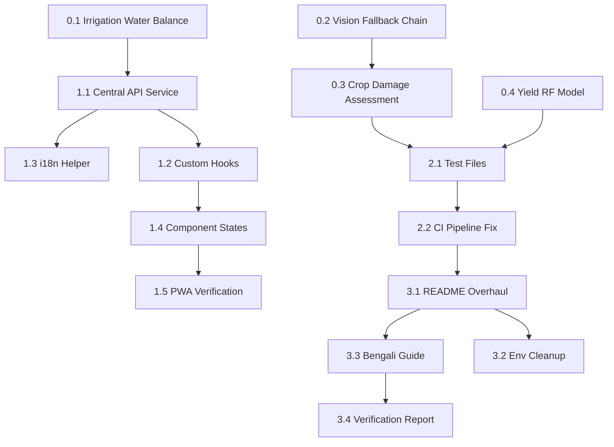

# KrishiBondhu — Production Hardening Implementation Plan

**Date:** 2026-05-08  
**Source:** PROJECT_AUDIT_REPORT.md  
**Goal:** Fix every audit failure and bring the system to production-grade quality.

---

## Codebase Snapshot (Current State)

| Area | Current State | Key Files |
|---|---|---|
| **Irrigation** | Simple moisture threshold heuristics | `tools/irrigation_tool.py` (WaterBalanceTool) |
| **Soil Vision** | Groq Llama 3.2 Vision only, no ViT | `tools/soil_tool.py`, `tools/vision_tool.py` |
| **Crop Damage** | CV2 green-pixel mask only | `tools/emergency_tool.py` (CropDamageAssessmentTool) |
| **Yield Prediction** | Hybrid simulation (base + NDVI + noise) | `services/yield_service.py` |
| **Weather Service** | Has Hargreaves-Samani stub but uses random weather data | `services/weather_service.py` |
| **Market Service** | Redis + Prophet structure exists but prices are random | `services/market_service.py` |
| **Frontend Services** | `services/api.js` exists but partial; hooks dir has only `useAgentSocket.js` | `frontend/src/services/`, `frontend/src/hooks/` |
| **CI Pipeline** | `test.yml` exists with Postgres+Redis services | `.github/workflows/test.yml` |
| **Tests** | 10 test files exist but missing key ones | `backend/tests/` |
| **PWA** | Manifest + icons present, VitePWA configured | `vite.config.js`, `public/` |
| **Env Config** | `example.env` exists but duplicated content, missing keys | `example.env` |

---

## Phase 0 — Backend Intelligence Upgrades

### 0.1 · Irrigation Water Balance (Hargreaves-Samani)

**Status:** `weather_service.py` already has `calculate_et0()` with the correct equation, but feeds it random weather data instead of NASA POWER API data.

**Files to modify:**
- `backend/app/services/weather_service.py`
- `backend/app/tools/irrigation_tool.py`

**Tasks:**

1. **`weather_service.py` — Real NASA POWER integration**
   - Replace the random weather simulation in `get_weather_data()` with an actual call to `https://power.larc.nasa.gov/api/temporal/daily/point` (same API already used in `SatelliteMoistureTool`).
   - Fetch parameters: `T2M_MAX`, `T2M_MIN`, `T2M`, `RH2M`, `PRECTOTCORR`, `ALLSKY_SFC_SW_DWN` (solar radiation).
   - Keep Redis caching (already present).
   - Add generic climate averages as fallback dict (keyed by month) for Bangladesh if API fails.

2. **`weather_service.py` — Soil water balance with crop coefficient + root depth**
   - Expand `calculate_water_balance()` to include:
     - `root_depth_mm` per crop (rice=300, potato=400, maize=600, default=350).
     - Available Water Capacity (AWC) estimation: `AWC = root_depth * 0.15` (loam default).
     - Depletion tracking: `depletion = previous_depletion + ETc - rainfall` (clamped to [0, AWC]).
     - Irrigation trigger: when depletion > 50% of AWC.
   - Keep current simple logic as the fallback path when NASA POWER API is unavailable.

3. **`irrigation_tool.py` — Wire WaterBalanceTool to WeatherService**
   - Refactor `WaterBalanceTool._run()` to instantiate `WeatherService` and call `calculate_water_balance()`.
   - Accept `crop`, `lat`, `lon` as primary inputs.
   - Preserve existing Bengali response strings.

---

### 0.2 · Soil Health Vision (ViT Fallback Chain)

**Status:** Both `soil_tool.py` and `vision_tool.py` go directly to Groq Llama Vision. The `model_config.py` defines `prof-freakenstein/plantnet-disease-detection` but it's never actually called in the soil/vision tools.

**Files to modify:**
- `backend/app/tools/vision_tool.py`
- `backend/app/tools/soil_tool.py`
- `backend/app/services/vision_service.py` *(new)*

**Tasks:**

1. **Create `backend/app/services/vision_service.py`** — Abstraction layer
   - Class `VisionService` with method `analyze_image(image_path, task)` where task is `"disease"` or `"soil"`.
   - **Tier 1 — HuggingFace Inference API:** Call `https://api-inference.huggingface.co/models/prof-freakenstein/plantnet-disease-detection` for disease. Use a suitable soil classifier for soil.
   - **Tier 2 — Groq LLM Vision:** Current Groq Llama 3.2 Vision code (extract from existing tools).
   - **Tier 3 — Rule engine:** Return hardcoded offline analysis strings.
   - Log a `WARNING` when falling back from Tier 1 to Tier 2, and from Tier 2 to Tier 3.

2. **Refactor `vision_tool.py`** — Use `VisionService`
   - Replace inline Groq code with `VisionService().analyze_image(image_path, "disease")`.
   - Remove dead `model_registry.get_disease_vision_model()` reference (line 57).

3. **Refactor `soil_tool.py`** — Use `VisionService`
   - Replace inline Groq code with `VisionService().analyze_image(image_path, "soil")`.

---

### 0.3 · Crop Damage Assessment

**Status:** `emergency_tool.py` uses a simple CV2 green-pixel mask. No model-based approach.

**Files to modify:**
- `backend/app/tools/emergency_tool.py`
- `backend/app/services/vision_service.py` (extend)

**Tasks:**

1. **Extend `VisionService`** with `assess_damage(image_path, crop_type)`:
   - **Tier 1 — HF Inference API:** Call a damage-detection model (placeholder: fine-tuned ViT). Parse confidence as damage percentage.
   - **Tier 2 — Groq Vision:** Send the image with a damage-assessment prompt asking for a numeric damage percentage.
   - **Tier 3 — Enhanced CV2 heuristic:** Keep existing green-pixel mask BUT add texture analysis using Laplacian variance. Final score: `damage = 0.6 * green_loss + 0.4 * texture_score`.

2. **Refactor `CropDamageAssessmentTool._run()`** to call `VisionService().assess_damage()`.

---

### 0.4 · Yield Prediction (Random Forest)

**Status:** `yield_service.py` uses a hardcoded formula. No trained model.

**Files to create/modify:**
- `backend/scripts/train_yield_model.py` *(new)*
- `backend/app/services/yield_service.py`

**Tasks:**

1. **Create `scripts/train_yield_model.py`**
   - Generate synthetic training data (~500 rows): features = `[ndvi, rainfall_mm, temp_mean, humidity, historical_avg_yield, input_cost_normalized]`, target = `yield_tons_per_bigha`.
   - Train a `sklearn.ensemble.RandomForestRegressor(n_estimators=100)`.
   - Save to `backend/models/yield_model.pkl` via `joblib.dump()`.
   - Print training metrics (MAE, R-squared).

2. **Refactor `yield_service.py`**
   - At module load: attempt `joblib.load("models/yield_model.pkl")`. Store in module-level variable.
   - In `predict_yield()`: if model loaded, construct feature vector and call `model.predict()`. Otherwise, use current hybrid simulation as fallback.
   - Log which path was taken.

---

## Phase 1 — Frontend Structure Fixes

### 1.1 · Central API Service

**Status:** `frontend/src/services/api.js` exists with `post()`, `get()`, and some exports. But many components use inline `fetch()`.

**File to modify:** `frontend/src/services/api.js`

**Tasks:**
1. Add auth header injection: read `krishi_auth_token` from localStorage, attach as `Authorization: Bearer <token>`.
2. Add missing exports: `getConversations`, `deleteConversation`, `postChat`, `postUploadAudio`, `postUploadImage`, `getMarketPrices`, `getMarketTrend`, `getDiaryEntries`, `postDiaryEntry`, `getDiaryReport`, `getAlerts`, `getCommunityQuestions`, `postCommunityQuestion`, `postCommunityAnswer`, `getDealers`, `getYieldPrediction`, `getSeasonPlan`, `getTraceabilityBatches`, `getSustainabilityScore`, `getWaterAdvice`.

---

### 1.2 · Custom Hooks

**Files to create:**
- `frontend/src/hooks/useApi.js` *(new)*
- `frontend/src/hooks/useOffline.js` *(new)*

**Tasks:**

1. **`useApi.js`** — Generic data-fetching hook: `useApi(fetchFn, deps)` returns `{ data, loading, error, refetch }`. Manages loading/error states. Aborts on unmount via `AbortController`.

2. **`useOffline.js`** — Offline-awareness hook: `useOffline()` returns `{ isOffline, pendingCount }`. Listens to `online`/`offline` events + `offline-sync-updated` custom event. Replaces inline logic currently in `App.jsx`.

---

### 1.3 · i18n Helper

**File to create:** `frontend/src/utils/i18n.js` *(new)*

**Tasks:**
1. Create a simple object-lookup bilingual system with `t(key, lang)` function.
2. Populate with ~30 UI strings (tab labels, status messages, button labels, error messages) in Bengali and English.

---

### 1.4 · Loading / Empty / Error States + `data-testid`

**Files to modify:** All 12 component files in `frontend/src/components/`.

**Tasks per component:**
1. Add `data-testid` attributes to all interactive elements.
2. Wrap data-dependent renders with loading skeleton, empty state message, and error banner with retry.
3. Priority components: `MarketIntelligence`, `FarmDiary`, `SoilHealth`, `WaterIrrigation`, `CommunityQA`, `Marketplace`, `EmergencySupport`, `FarmOverview`.

---

### 1.5 · PWA Verification

**Status:** `vite.config.js` has VitePWA config, icons exist. Mostly complete.

**Tasks:**
1. Add missing icons referenced in config: `favicon.ico`, `apple-touch-icon.png`, `masked-icon.svg`.
2. Add `<meta name="theme-color">` to `index.html` if missing.
3. Add workbox `runtimeCaching` rules for API calls to VitePWA config.

---

## Phase 2 — Testing & Validation

### 2.1 · Test Files to Create

| File | Tests | Description |
|---|---|---|
| `conftest.py` | fixtures | Async SQLite DB, TestClient, mock Redis, env vars |
| `test_market_tools.py` | 5 | Price fetch, trend fallback, normalize, cache, DB save |
| `test_diary_tools.py` | 4 | Entry creation, P&L report, PDF gen, empty diary |
| `test_carbon_calculator.py` | 4 | Footprint calc, practice detection, grading, zero-emission |
| `test_agent_fallbacks.py` | 5 | Vision chain, weather fallback, yield fallback, GPS missing, CV2 unavailable |
| `test_api_endpoints.py` | 8 | Integration tests for all major API routes |

---

### 2.2 · CI Pipeline Updates

**File to modify:** `.github/workflows/test.yml`

**Tasks:**
1. Fix garbled lint command on line 23 (`--select=E9,F69 import-python-optimizer`).
2. Add `GROQ_API_KEY=""` env var to force fallback paths in tests.
3. Add `pytest --tb=short -q` flags for cleaner output.

---

## Phase 3 — Documentation & Finalization

### 3.1 · README.md Overhaul

**Tasks:**
1. **Architecture Diagram** (Mermaid): Frontend → FastAPI → CrewAI → 16 Agents → Services → PostgreSQL + Redis → External APIs.
2. **Environment Setup** section listing all env vars.
3. **Docker Compose** quick-start instructions.
4. **API Documentation** link: `http://localhost:8000/docs`.
5. **Running Tests** section.

### 3.2 · `.env.example` Cleanup

1. Remove duplicated content (lines 33-64 repeat lines 1-32).
2. Add missing keys: `REDIS_URL`, `WEATHER_API_KEY`, `MARKET_API_KEY`, `SMS_GATEWAY_KEY`, `HELPLINE_NUMBER`, `SENTINEL_HUB_KEY`, `OFFLINE_MODE_ENABLED`, `GROQ_API_KEY`.
3. Use `your_key_here` placeholders (remove real API keys).

### 3.3 · Bengali Farmer Guide

**Create:** `docs/FARMER_GUIDE_BN.md` — Short guide in Bengali covering login, image upload, market prices, farm diary, and emergency support.

### 3.4 · Fix Verification Report

**Create:** `FIX_VERIFICATION_REPORT.md` — Re-assess every audit line item, mark as RESOLVED / PARTIAL / REMAINING.

---

## File Inventory

### New Files (14)
| # | File | Phase |
|---|---|---|
| 1 | `backend/app/services/vision_service.py` | 0.2 |
| 2 | `backend/scripts/train_yield_model.py` | 0.4 |
| 3 | `backend/models/yield_model.pkl` | 0.4 (generated) |
| 4 | `frontend/src/hooks/useApi.js` | 1.2 |
| 5 | `frontend/src/hooks/useOffline.js` | 1.2 |
| 6 | `frontend/src/utils/i18n.js` | 1.3 |
| 7 | `backend/tests/conftest.py` | 2.1 |
| 8 | `backend/tests/test_market_tools.py` | 2.1 |
| 9 | `backend/tests/test_diary_tools.py` | 2.1 |
| 10 | `backend/tests/test_carbon_calculator.py` | 2.1 |
| 11 | `backend/tests/test_agent_fallbacks.py` | 2.1 |
| 12 | `backend/tests/test_api_endpoints.py` | 2.1 |
| 13 | `docs/FARMER_GUIDE_BN.md` | 3.3 |
| 14 | `FIX_VERIFICATION_REPORT.md` | 3.4 |

### Modified Files (16+)
| # | File | Phase | Change |
|---|---|---|---|
| 1 | `backend/app/services/weather_service.py` | 0.1 | NASA POWER API, climate fallback |
| 2 | `backend/app/tools/irrigation_tool.py` | 0.1 | Wire to WeatherService |
| 3 | `backend/app/tools/vision_tool.py` | 0.2 | Use VisionService |
| 4 | `backend/app/tools/soil_tool.py` | 0.2 | Use VisionService |
| 5 | `backend/app/tools/emergency_tool.py` | 0.3 | Use VisionService for damage |
| 6 | `backend/app/services/yield_service.py` | 0.4 | Load RF model + fallback |
| 7 | `frontend/src/services/api.js` | 1.1 | Expand endpoints + auth |
| 8-19 | `frontend/src/components/*.jsx` | 1.4 | Loading/error/empty + testid |
| 20 | `frontend/vite.config.js` | 1.5 | Workbox caching |
| 21 | `.github/workflows/test.yml` | 2.2 | Fix lint, add env vars |
| 22 | `README.md` | 3.1 | Architecture + setup |
| 23 | `example.env` | 3.2 | Dedup + add keys |

---

## Execution Order

---

## Risk Register

| Risk | Mitigation |
|---|---|
| NASA POWER API rate limits / downtime | Climate average fallback dict hardcoded per month |
| HuggingFace Inference API latency (>10s) | 8s timeout, auto-fallback to Groq |
| `prof-freakenstein/plantnet-disease-detection` unavailable | Fallback to Groq Vision, then rule engine |
| `yield_model.pkl` not generated before deploy | Hybrid simulation remains as fallback |
| Redis not running in dev | Wrap all Redis calls in try/except, fall back to in-memory dict |
| Large model downloads in CI | Tests mock all external API/model calls |

---

> [!IMPORTANT]
> **Rule: No functionality removal.** Every existing working feature is preserved. New code wraps existing logic as the fallback tier in a chain. All refactors are additive.
