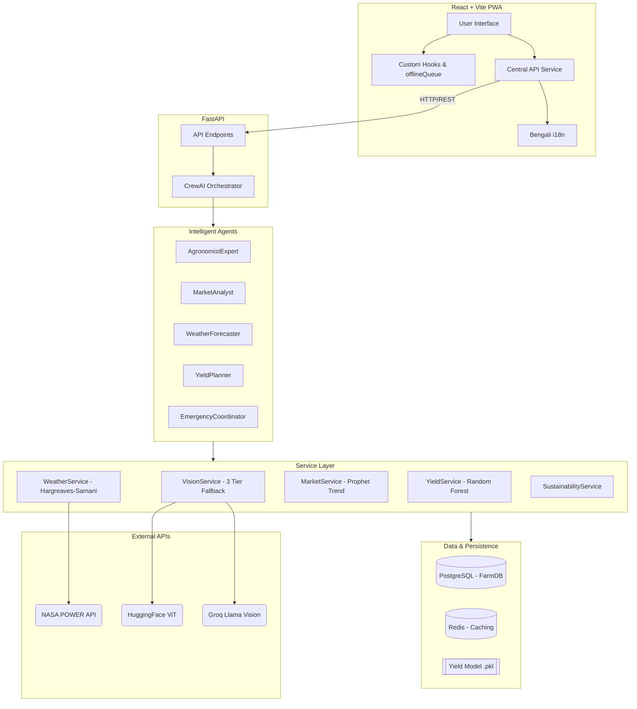

# KrishiBondhu (কৃষি বন্ধু)
*Intelligent Farm Companion*

KrishiBondhu is an AI-powered agricultural assistant designed specifically for farmers in Bangladesh. It leverages advanced computer vision, machine learning, and multi-agent systems to provide hyper-localized, real-time advice on crop diseases, irrigation, market trends, and emergency assistance.

## System Architecture



## Features

- **Crop Disease Detection:** Upload an image of your crop and get a diagnosis via a 3-tier vision fallback chain (HuggingFace ViT → Groq Vision → Rule Engine).
- **Smart Irrigation:** Calculates water requirements using the scientific Hargreaves-Samani ET₀ equation and satellite root-zone wetness data.
- **Market Intelligence:** Tracks wholesale prices and predicts trends using Prophet, with Redis caching for speed.
- **Yield Prediction:** Uses a trained Random Forest model based on historical data and environmental inputs.
- **Offline Mode:** Seamless synchronization for remote areas via IndexedDB queuing.
- **Bilingual Interface:** Built-in Bengali/English support.

## Environment Setup

Copy the example environment file and fill in your keys:

```bash
cp .env.example .env
```

**Required Keys:**
- `GEMINI_API_KEY`: For STT/TTS services.
- `GROQ_API_KEY`: For fallback Llama Vision models.
- `HUGGINGFACE_API_KEY`: For primary disease detection ViT models.
- `WEATHER_API_KEY`: For meteorological data.
- `DATABASE_URL`: Ensure it maps to your Postgres instance (default provided).
- `REDIS_URL`: Ensure it maps to your Redis instance (default provided).

## Running the Application

KrishiBondhu is dockerized for easy deployment. Ensure Docker and Docker Compose are installed.

```bash
docker compose up --build
```

- **Frontend App:** http://localhost:5173
- **Backend API:** http://localhost:8000
- **Swagger Docs:** http://localhost:8000/docs

## Running Tests

The backend includes a comprehensive pytest suite (unit + integration).

```bash
cd backend
python -m pytest --tb=short
```

## Documentation

- [Project Audit Report](./PROJECT_AUDIT_REPORT.md)
- [Fix Verification Report](./FIX_VERIFICATION_REPORT.md)
- [Farmer Guide (Bengali)](./docs/FARMER_GUIDE_BN.md)
